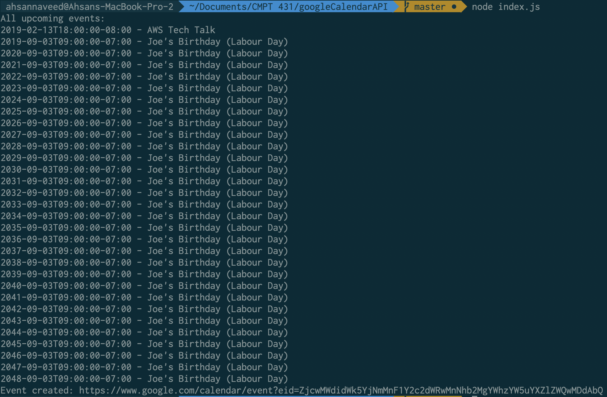
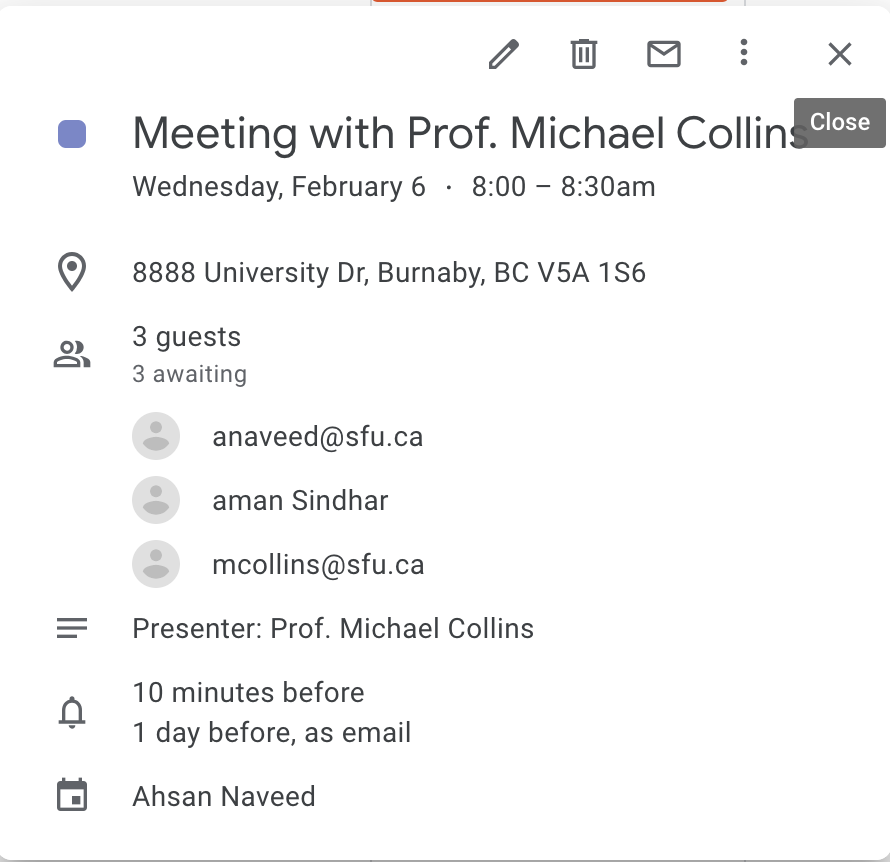

## Summary

A client Web application.

1. The web app first gets all the upcoming events in the Calendar using the Google Calendar API and list them neatly in a readable manner.

2. The app then creates a meeting event for February 6th 2019 to be held at Simon Fraser University, Burnaby, Canada with the presenter being Prof. Michael Collins. The response from the server on successful insertion of the event on to the google calendar is a URL displayed in the app.

## Getting Started:

1. `git clone https://github.com/ahsannaveed007/bonus_part.git`
2. `cd bonus_part && npm install`
3. `node inde.jx`

## Output

1. Response from Google Calendar API:
   

2. Visit `https://www.google.com/calendar/event?eid=ZjcwMWdidWk5YjNmMnF1Y2c2dWRwMnNhb2MgYWhzYW5uYXZlZWQwMDdAbQ` to see the created event:
   
